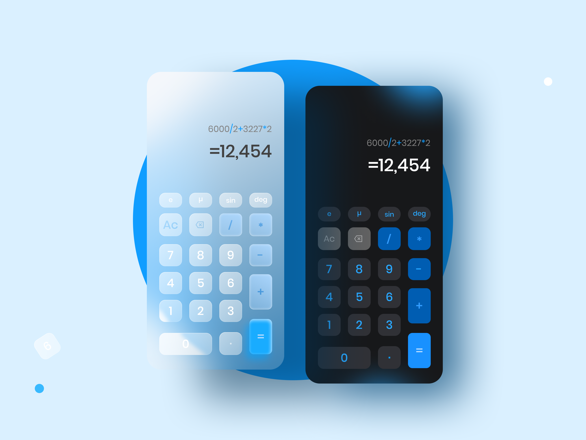
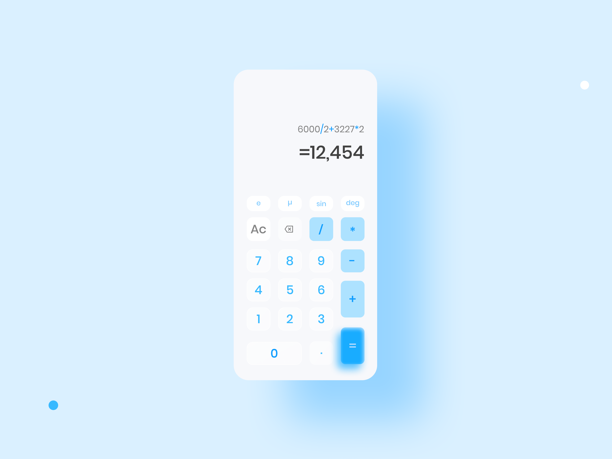
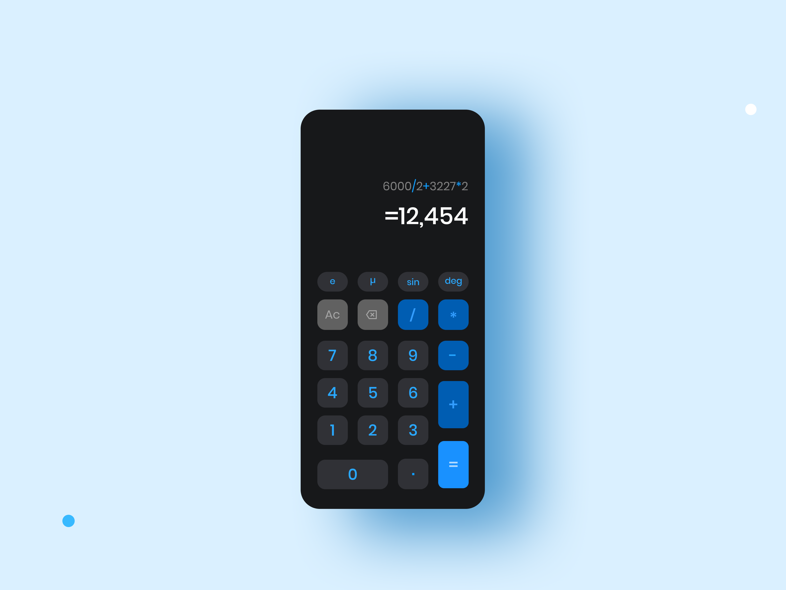

# Calculator App

Welcome to the Calculator App, a versatile Flutter project designed for effortless mathematical computations. This app is crafted with the powerful GetX state management solution, offering both light and dark themes for user preference.

## Overview

  
  

## Light and Dark Themes

  
  

## Project Overview

### Features

- **Efficient Calculations:** Perform various mathematical computations with ease and speed.
- **Light and Dark Themes:** Switch between themes for a personalized visual experience.
- **History Tracking:** Keep track of previous calculations for reference.
- **Getx State Management:** Utilize GetX for lightweight and intuitive state management.
- **User-Friendly Interface:** Enjoy a clean and intuitive user interface for seamless usage.

### Tech Stack

- **Flutter:** Develop an efficient and responsive UI with Flutter's framework.
- **GetX State Management:** Employ GetX for efficient and intuitive state management, enhancing the app's performance.
- **Theme Switching:** Implement both light and dark themes to cater to user preferences.
- **Mathematical Logic:** Integrate logical components for accurate and fast mathematical calculations.
- **User Interface Design:** Craft an intuitive and user-friendly interface for smooth user interactions.
